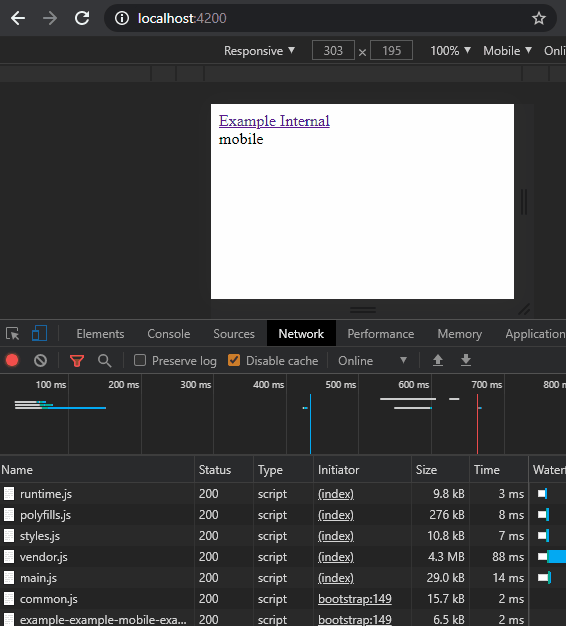

# Mobile or Web - Alternative B

> _Uso do `@angular/router`_

A sugestão dessa **alternativa**

| arquivos                                   | descrição                                                   |
| ------------------------------------------ | ----------------------------------------------------------- |
| `*.routing.module.ts` e `*-mobile.routing.module.ts`     | configuração do roteamento                                  |
| `*.module.ts` e `*-mobile.module.ts`       | configuração de módulos. Diferencial é os _imports_         |
| `*.component.ts` e `*-mobile.component.ts` | `*-mobile.component*` apenas estende `*.component`          |
| `*.component.html`                         | ambos usam o mesmo. Os seletores precisam existir em ambos. |

**pós**: ~~estrutura fica mais limpa e fácil entendimento~~.

**contra** ~~não dá para intercalar entre web/mobile, como é feito na _alt/a_ e _alt/c_ - isso é ideal apenas para debugar~~

**relatórios**

- em prod, dispara erro de componente N estar em dois módulos. Para "burlar" isso, [usado essa sugestão](https://github.com/angular/angular/issues/10646#issuecomment-239181520). No qual a solução é extender.
<!--

# MobileOrWeb

This project was generated with [Angular CLI](https://github.com/angular/angular-cli) version 8.3.28.

## Development server

Run `ng serve` for a dev server. Navigate to `http://localhost:4200/`. The app will automatically reload if you change any of the source files.

## Code scaffolding

Run `ng generate component component-name` to generate a new component. You can also use `ng generate directive|pipe|service|class|guard|interface|enum|module`.

## Build

Run `ng build` to build the project. The build artifacts will be stored in the `dist/` directory. Use the `--prod` flag for a production build.

## Running unit tests

Run `ng test` to execute the unit tests via [Karma](https://karma-runner.github.io).

## Running end-to-end tests

Run `ng e2e` to execute the end-to-end tests via [Protractor](http://www.protractortest.org/).

## Further help

To get more help on the Angular CLI use `ng help` or go check out the [Angular CLI README](https://github.com/angular/angular-cli/blob/master/README.md). -->

### Referência

- [Router](https://angular.io/api/router/Router)
